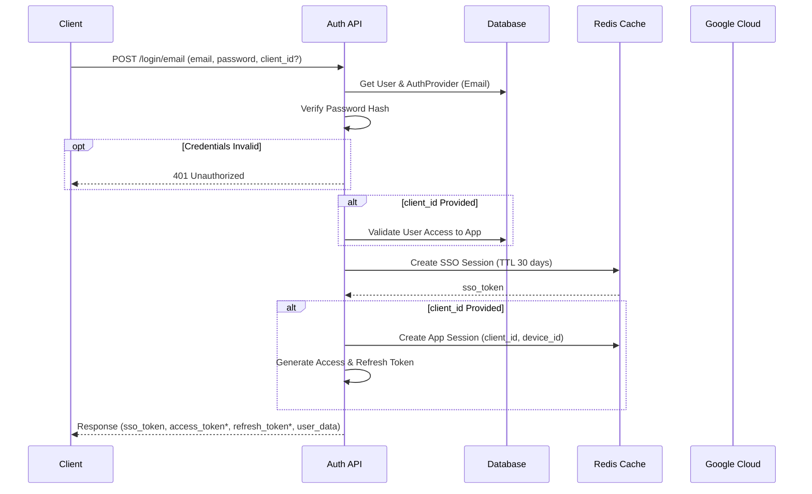
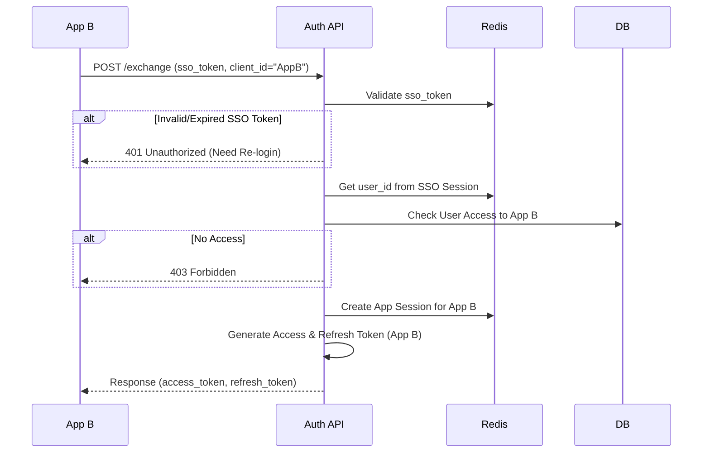

# Arga SSO Backend Flow

Dokumentasi lengkap mengenai flow autentikasi dan otorisasi pada `arga-sso-backend`.

## 1. Arsitektur Umum

Backend ini menggunakan arsitektur modular dengan pembagian tanggung jawab sebagai berikut:
- **Core**: Middleware, Security, Config, Shared Utilities.
- **Modules**:
    - `auth`: Logic autentikasi, login, logout, token management.
    - `users`: Manajemen data user, profile, CRUD user.
    - `applications`: Manajemen aplikasi client (Client ID, Secret, Settings).

---

## 2. Authentication Flow

Sistem ini mendukung **Single Sign-On (SSO)**. User login sekali untuk mendapatkan sesi global (SSO Session), yang kemudian digunakan untuk mendapatkan akses ke aplikasi spesifik tanpa login ulang.

### A. Login Flow (Email/Password)

Endpoint: `POST /api/v1/auth/login/email`



**Keterangan:**
1.  **Validasi Kredensial**: Password diverifikasi menggunakan `bcrypt`.
2.  **SSO Session**: Selalu dibuat saat login berhasil. Disimpan di Redis dengan key `sso:{user_id}`.
3.  **App Session**: Jika `client_id` dikirim, sesi aplikasi spesifik dibuat (key `session:{user_id}:{client_id}:{device_id}`).

### B. SSO Token Exchange (Silent Login)

Digunakan ketika user pindah dari App A ke App B. User sudah punya `sso_token` dari login sebelumnya.

Endpoint: `POST /api/v1/auth/exchange`



**Penting**: `sso_token` adalah kunci rahasia sesi global. Jangan diekspos ke publik.

---

## 3. Authorization Flow

Setiap request ke endpoint terproteksi harus melalui validasi token.

### Middleware & Dependency Injection

1.  **Middleware Stack**:
    - `CORSMiddleware`: Mengatur Cross-Origin Resource Sharing.
    - `LoggingMiddleware`: Logging request/response.
    - `ErrorHandlerMiddleware`: Menangkap exception global.

2.  **Token Validation (`get_current_user`)**:
    - Client mengirim header `Authorization: Bearer <access_token>`.
    - `get_current_user` memverifikasi signature JWT.
    - Mengambil `user_id` dan `role` dari payload token.

### Role-Based Access Control (RBAC)

Menggunakan decorator `@require_role` atau `RoleChecker`.

```python
# Contoh penggunaan
@router.post("/users", dependencies=[Depends(require_admin)])
async def create_user():
    ...
```

**Roles Available**:
- `SUPERADMIN`
- `ADMIN`
- `USER`
- `GUEST`

---

## 4. User Management

Modul `users` menangani CRUD user dan profil.

- **Create**: Admin membuat user baru -> `UserCommands.create`.
- **Update**: User/Admin update data -> `UserCommands.update`.
- **Penyimpanan File**: Avatar diupload ke Google Cloud Storage (GCP).
    - `file_upload.py` menangani upload dan generate signed URL.

---

## 5. Token Management

- **Access Token**: JWT, expired pendek (misal 15-60 menit). Berisi klaim `sub` (user_id), `role`, `client_id`, `allowed_apps`.
- **Refresh Token**: JWT/Opaque, expired panjang (misal 7-30 hari). Disimpan di Redis (`session_service`).
- **Refresh Flow**: `POST /auth/refresh` -> Validasi refresh token di Redis -> Generate pair token baru -> Rotate refresh token (hapus lama, buat baru).

## Ringkasan Komponen Utama

| Komponen | File Utama | Deskripsi |
| :--- | :--- | :--- |
| **Auth Router** | `app/modules/auth/routers/auth.py` | Endpoint login, logout, refresh, exchange. |
| **Auth Service** | `app/modules/auth/services/auth_service.py` | Logic utama koordinasi login & token. |
| **SSO Service** | `app/modules/auth/services/sso_session_service.py` | Manage global session di Redis. |
| **Token Helper** | `app/modules/auth/utils/token_helper.py` | Helper buat generate token response. |
| **Security** | `app/core/security/authorization.py` | `get_current_user` dependency. |
